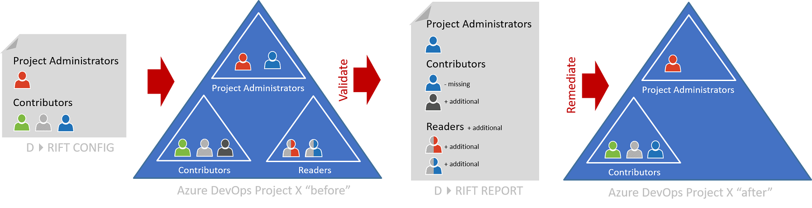
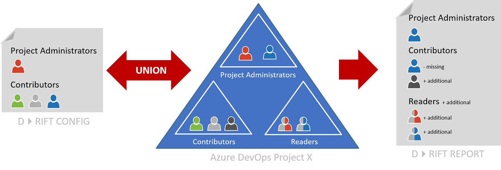

# azure-devops-anti-drift

Welcome to the tool to detect and remediate configuration drift between team projects in Azure DevOps

[](https://dev.azure.com/almdevopsrangers/ALM-DevOps/_build/latest?definitionId=3&branchName=master)

[](https://dev.azure.com/almdevopsrangers/3f3c18fd-c194-4fea-8dfb-e7f2f47dbf3a/_boards/board/t/38ae7542-480c-4a9a-a322-7f44247f227a/Microsoft.RequirementCategory/)

---

## Overview

We allow you to determine whether your Azure DevOps configuration has "drifted" from an expected configuration and optionally remediate any drift. The azure-devops-anti-drift solution can be run in in two validation modes:

- **Validate**  - Report on configuration D>RIFT. The validated AzDO project remains unchanged.
- **Remediate** - Report on and remediate configuration D>RIFT. The **validated** AzDO project is updated to match the D>RIFT configuration.



In either validation modes, you can use two **comparison** modes:

- **Union** - Consider all differences, comparing the D>RIFT configuration with the actual configuration, and vice versa.

- **Intersect** - Consider only the D>RIFT configuration with the actual configuration. Configuration not covered in the D>RIFT configuration is ignored.


---

## Roadmap

| FEATURE     | AZDO CONFIGURATION                  | DESCRIPTION                                         | PLAN |
|-------------|-------------------------------------|-----------------------------------------------------| -----|
| Validation  | Root project permissions            | Validate project-level permission D>RIFT            | ? |
| Validation  | Root pipeline permissions           | Validate Azure Pipeline root permission D>RIFT      | ? |
| Validation  | Root repos permissions              | Validate Azure Repos root permission D>RIFT         | ? |
| Validation  | Root board permissions              | Validate Azure Boards root permission D>RIFT        | ? |
| Validation  | Root artifact permissions           | Validate Azure Artifacts root permission D>RIFT     | ? |
| Validation  | Organizational project permissions  | Validate organization-level permission D>RIFT       | ? |
| Validation  | Pipeline permissions                | Validate Azure Pipeline and stage permission D>RIFT | ? |
| Validation  | Repos Permissions                   | Validate Azure Repos root permission D>RIFT         | ? |
| Validation  | Artifact feed permissions           | Validate Azure Artifact feed root permission D>RIFT | ? |
| Remediation | All permissions                     | Remediate permissions to match D>RIFT configuration | ? |

---

## Run the program

> TBD

---

## Configuration


### Example Files

| FILE      | FILES    | DESCRIPTION |
|-----------|----------|-------------|
| Example 1 | Full.yml | Simple full configuration defined in one YAML document. |
| Example 2 | Mappings.yml<br/>Patterns.yml<br/>Team Projects.yml<br/>Teams.yml | Simple configuration defined in seperate YAML documents. |
| Example 3 | Security - Default.yml<br/>Mappings.yml<br/>Team Projects.yml<br/>Teams.yml | |
| Example 4 | Drift.IT-DevOps.yml | Sample configuration from one of our early adopter implementations. |

### Drift.IT-DevOps.yml Example

Let us walk through Example 4, Drift.IT-DevOps.yml, from the bottom up.

The mapping section maps keys to actual team project identifiers, such as the Azure DevOps project GUID.

```
# Mappings
Mappings:
  00001: 282397a2-dc94-4a5f-9ce8-628db489a098 # Mapping key to actual team project identifier.
```
The Team Projects section defines the configurations to validate, such as the project-level security permissions. The **Key** is used to generate the security group. **Name**, and **Alias** are used to replace placeholders in other sections of the D>RIFT configuration. See !Security section below for an example.

```
# Team Projects
TeamProjects:
- Key: 00001 # Key is used to generate the security group
  Name: IT-DevOps
  Alias: IT_DevOps
  Patterns: 
  - !Security
    Name: Default # References the Default security pattern
  AgentPools:
  - Azure Pipelines
  Status: Active # Active, Archived (meaning still available but readonly), Removed.
  Teams:
```

The !Security Pattern describes the project-level application **groups**, **members**, and **permissions** we expect. For example in lines 100-110, we expect a **Project Administrators** group at the project level, with one member **Azure_IT_DevOps_BuildAdministrators**, and three allowed permissions for **Analytics**. Note that we used the Alias to convert Azure_{teamProject.Alias}_BuildAdministrators to Azure_IT_DevOps_BuildAdministrators.

```
# Patterns
Patterns:
- !Security # Exclamation mark is not actual yaml, but the yaml library understands it as inheritance, parent is pattern
  Name: Default
  ApplicationGroups:
  - Name: Build Administrators
    Members: 
    - Azure_{teamProject.Alias}_BuildAdministrators # {0} will be replaced with a key using a string.format
    Namespaces:
    - Name: Analytics
        Allow:
        - Delete shared Analytics View
        - Edit shared Analytics View
        - View Analytics
        Deny:
        Not Set:
    - Name: Build
        Allow:
        - Administer build permissions
        - Delete build pipeline
        - Delete builds 
        - Destroy builds
        - Edit build pipeline
        - Edit build quality
        - Manage build qualities
        - Manage build queue
        - Queue builds
        - Retain indefinitely
        - Stop builds
        - View build pipeline
        - View builds
        Deny:
        Not Set:
        - Override check-in validation by build
        - Update build information
    - Name: Git Repositories
        Allow:
        - Contribute
        - Contribute to pull requests
        - Create branch
        - Create tag
        - Manage notes
        - Read
        Deny:
        Not Set:
        - Bypass policies when completing pull requests
        - Bypass policies when pushing
        - Create repository
        - Delete repository
        - Edit policies
        - Force push (rewrite history, delete branches and tags)
        - Manage permissions
        - Remove others' locks
        - Rename repository   
    - Name: Project
        Allow:
        # General
        - View project-level information
        # Boards
        - Create tag definition
        # Test Plans
        - Create test runs
        - Delete test runs
        - Manage test configurations
        - Manage test environments
        - View test runs
        Deny:
        Not Set:
        # General
        - Delete team project
        - Edit project-level information
        - Manage project properties
        - Rename team project
        - Suppress notifications for work item updates
        - Update project visibility
        # Boards
        - Bypass rules on work item updates
        - Change process of team project.
        - Delete and restore work items
        - Move work items out of this project
        - Permanently delete work items
    - Name: ReleaseManagement
        Allow:
        Deny:
        Not Set:
        - Administer release permissions
        - Create releases
        - Delete release pipeline
        - Delete release stage
        - Delete releases
        - Edit release pipeline
        - Edit release stage
        - Manage deployments
        - Manage release approvers
        - Manage release settings
        - Manage releases
        - Manage TaskHub Extension
        - View release pipeline
        - View releases

  - Name: Contributors
      ... See Example 4 for the complete configuration
```